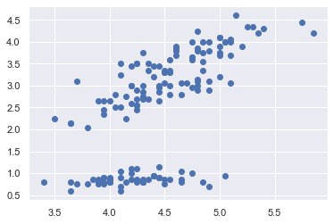

# ACM Research Coding Challenge (Fall 2020)

## No Collaboration Policy

**You may not collaborate with anyone on this challenge.** You _are_ allowed to use Internet documentation. If you _do_ use existing code (either from Github, Stack Overflow, or other sources), **please cite your sources in the README**.

## Submission Procedure

Please follow the below instructions on how to submit your answers.

1. Create a **public** fork of this repo and name it `ACM-Research-Coding-Challenge`. To fork this repo, click the button on the top right and click the "Fork" button.
2. Clone the fork of the repo to your computer using . `git clone [the URL of your clone]`. You may need to install Git for this (Google it).
3. Complete the Challenge based on the instructions below.
4. Email the link of your repo to research@acmutd.co with the same email you used to submit your application. Be sure to include your name in the email.

## Question One

 
Given the following dataset in `ClusterPlot.csv`, determine the number of clusters by using any clustering algorithm. **You're allowed to use any Python library you want to implement this**, just document which ones you used in this README file. Try to complete this as soon as possible.

Regardless if you can or cannot answer the question, provide a short explanation of how you got your solution or how you think it can be solved in your README.md file.

Daniel Jones
-------------------------------------------------------------------
Libraries:
* csv
* sklearn
* matplotlib
* random

Solution:
I began by researching different clustering algorithms. Various algorithms assumed more regular shapes for clusters which would not work well for the rather elongated clusters from the
data set. I chose DBSCAN because it dealt well with most shapes and it could find the outliers presented in the dataset and remove them from any cluster.
After converting the .csv file to a nested loop (in the form of a matrix), I plotted their points to verify that the dataset was transferred correctly and created various functions to
help with plotting points later. Next, I began working on using the algorithm to fit the data. I struggled understanding how the algorithm output the data until I read the documentation
and looked at various examples (primarily the one on the scikit website: https://scikit-learn.org/stable/auto_examples/cluster/plot_dbscan.html#sphx-glr-auto-examples-cluster-plot-dbscan-py).
However, even after the algorithm outputted the proper data, I continually got 0 clusters. While, importing the data I had forgotten to remove the first column that indicated what number point
it was. After fixing this and tweaking the resulting code, the final step was outputting the data via a scatter plot and a string output. Though I struggled, I eventually created my own way
of plotting the points by matching a point to its result in the outputted list of labels from the algorithm. Next, I generated a random color for each cluster and plotted corresponding points.
While there are a few points that are outliers despite being quite close, I left the two parameters: epsilon (or minimum distance to a neighbor) and minimum samples (amount needed to form
independent clusters) at 0.2 and 5 respectively. With some more tweaking I could most likely optimize the parameters to more accuratly predict clusters.